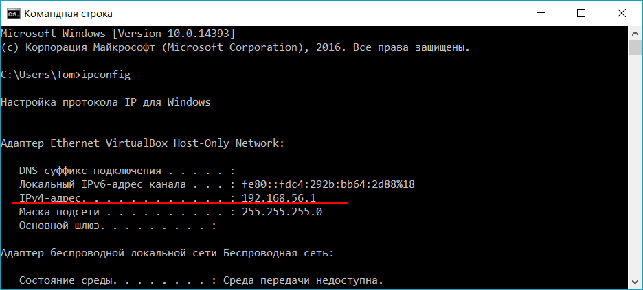

# FAMILY-SHARING API

## Как запустить

1. Скачате [последнюю версию](https://github.com/J31019/family-api/releases) API. Файл `api.exe`.

2. Откройте консоль и запустите команду `ipconfig`
```cmd
C:\>ipconfig
```
В появившемся списке конфигураций найдите строку `IPv4-адрес` и скопируйте локальный адрес вашей сетевой карты.



3. Оставаясь в консоли, командой `cd` перейдите в папку, где расположен скачанный файл `api.exe`.
Например,
```cmd
C:\>cd Users\Tom\Downloads
```

4. Запустите `api.exe` c флагом `-addr`, указав IP-адрес и порт:
```cmd
C:\Users\Tom\Downloads>api -addr 192.168.56.1:8080
```
Готово!

5. Чтобы остановить работу сервера, в консоли нажмите сочетание клавиш `Ctrl+C`.